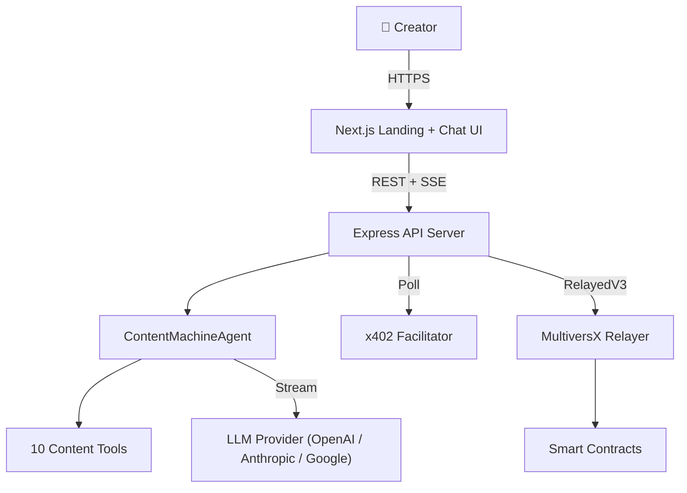

# 🎯 The Content Machine

> **One Command. Live Content Agent.** — Fork, customize your brand voice, launch, earn.

A complete, production-ready AI agent that acts as your **content operations team**. Monitors trends, writes in your brand voice, generates social posts, blogs, video scripts, thumbnails — and manages your content calendar. Powered by MultiversX micropayments.

---

## ⚡ One-Command Launch

```bash
git clone https://github.com/AIS-MultiversX/mx-openclaw-content-machine my-content-machine
cd my-content-machine
cp brand-voice.example.json brand-voice.json  # Customize your voice
npm run launch
```

That's it. The script walks you through everything:

```
Step 1:   📛  Name your agent, pick your LLM, enter API key
Step 2:   🔐  Generate wallet + .env + config
Step 3:   📦  Install all dependencies
Step 4:   💰  Fund wallet from devnet faucet
Step 5:   📝  Register agent on MultiversX blockchain
Step 6:   🏗️   Build manifest + mint identity NFT
Step 7:   ✅  Build TypeScript + run all tests
Step 8:   🔒  Provision VPS (firewall, SSH hardening, Docker)
Step 9:   🚀  Deploy to VPS (docker compose up)
Step 10:  🏥  Verify — health check confirms agent is live
```

**Result:** Your content machine is live at `https://yourdomain.com` — generating and scheduling content.

> Want to skip VPS and run locally? Use `npm run launch:local`

---

## 🧠 What The Content Machine Does

| Capability | Tool | What It Does |
|:---|:---|:---|
| 🔍 **Trend Monitoring** | `monitor_feeds` | Scans RSS, Reddit, and web for trending topics |
| 🎯 **Brand Voice** | `analyze_brand_voice` | Loads your writing style profile to match your exact tone |
| 🔎 **Research** | `search_web` + `scrape_page` | Searches the web and reads pages for content data |
| 📱 **Social Posts** | `generate_short_content` | Creates X, LinkedIn, Instagram, Threads posts |
| 📝 **Blog Posts** | `generate_long_content` | Writes SEO-optimized blogs, newsletters, articles |
| 🎬 **Video Scripts** | `generate_video_script` | Produces scripts with hooks, timestamps, CTAs |
| 🖼️ **Thumbnails** | `generate_thumbnail` | Generates social graphics and YouTube thumbnails |
| 📅 **Scheduling** | `schedule_content` | Queues content for publish across platforms |
| 🗓️ **Calendar** | `content_calendar` | Generates weekly content calendars |

---

## 🎨 Brand Voice Profile

The killer feature. Create `brand-voice.json` to define your exact writing style:

```json
{
    "tone": "Professional yet approachable. Uses data to back up claims.",
    "vocabulary": ["actionable", "scalable", "data-driven"],
    "doList": ["Use short, punchy sentences", "Start with a hook"],
    "dontList": ["Don't use jargon", "Don't start with clichés"],
    "examplePosts": ["We analyzed 10,000 SaaS companies..."],
    "hashtagStrategy": "Use 3-5 relevant hashtags",
    "targetAudience": "Founders and creators building digital businesses",
    "contentPillars": ["Industry insights", "How-to guides", "Case studies"]
}
```

See `brand-voice.example.json` for a complete example.

---

## 🏗️ Architecture



| Layer | Technology |
|:---|:---|
| Frontend | Next.js 15, Material Design 3, `useChat` + `usePayment` hooks |
| Backend | Express, TypeScript, SSE streaming |
| Agent | ContentMachineAgent — 10 tools for full content ops |
| LLM | Generic adapter — OpenAI, Anthropic, Google (via `LLM_API_KEY`) |
| Payments | MultiversX x402, RelayedV3 (gasless) |
| Identity | Soulbound Agent NFT on Identity Registry |
| CI/CD | GitHub Actions (lint → test → deploy), 80% coverage gate |
| Deploy | Docker Compose, Caddy (auto-SSL), hardened Ubuntu VPS |

---

## 📁 Project Structure

```
mx-openclaw-content-machine/
├── launch.sh                ← ⭐ ONE COMMAND: zero to live agent
├── brand-voice.example.json ← 🎯 Your writing style profile
├── agent.config.example.json← 💰 Pricing and services
├── backend/
│   ├── src/
│   │   ├── server.ts        ← API routes: chat, upload, agent, health
│   │   ├── agent/
│   │   │   ├── content-machine-agent.ts  ← 🎯 THE CONTENT MACHINE
│   │   │   ├── base-agent.ts             ← Abstract base class
│   │   │   └── tools/
│   │   │       ├── monitor_feeds.ts      ← RSS/Reddit scanner
│   │   │       ├── analyze_brand_voice.ts← Brand voice loader
│   │   │       ├── generate_short_content.ts ← Social posts
│   │   │       ├── generate_long_content.ts  ← Blogs/newsletters
│   │   │       ├── generate_video_script.ts  ← Video scripts
│   │   │       ├── generate_thumbnail.ts     ← Graphics/thumbnails
│   │   │       ├── schedule_content.ts       ← Content queue
│   │   │       └── content_calendar.ts       ← Weekly calendar
│   │   ├── llm/             ← LlmService (OpenAI / Anthropic / Google)
│   │   ├── routes/          ← Agent-Native API
│   │   ├── session/         ← In-memory + SQLite store
│   │   ├── mx/              ← MultiversX SDK
│   │   └── cron/            ← Proactive task scheduler
│   └── Dockerfile
├── frontend/                ← Next.js chat + landing page
├── scripts/                 ← CLI lifecycle (setup, register, fund)
├── infra/                   ← VPS provisioning + deploy
└── docker-compose.yml       ← Full-stack orchestration
```

---

## 📋 All Commands

| Command | Description |
|:---|:---|
| **`npm run launch`** | **⭐ One command — zero to live content machine** |
| `npm run launch:local` | Same but skip VPS, run locally |
| `npm run setup` | Interactive setup wizard |
| `npm run dev` | Start local dev servers |
| `npm run register` | Register agent on MultiversX |
| `npm run fund` | Get devnet faucet tokens |

---

## 🔧 Configuration

| Variable | Default | Description |
|:---|:---|:---|
| `LLM_API_KEY` | — | Your LLM provider API key |
| `LLM_PROVIDER` | `openai` | `openai`, `anthropic`, or `google` |
| `PRICE_PER_QUERY` | `0.25` | Price in USDC per query |
| `AGENT_NAME` | `content-machine` | On-chain agent name |
| `SEARCH_API_KEY` | — | Tavily API key for live web search |
| `IMAGE_API_KEY` | — | OpenAI API key for DALL-E thumbnails |
| `BRAND_VOICE_FILE` | `./brand-voice.json` | Path to brand voice profile |

See `.env.example` for the full list.

---

## 🧪 Testing

```bash
cd backend && npm test          # All tests
cd backend && npm run lint      # 0 errors
cd backend && npm run test:coverage  # Coverage report
```

---

## 💡 Example Queries

Once your Content Machine is running:

- *"What's trending in AI this week? Give me 5 content ideas."*
- *"Write a LinkedIn post about the future of AI agents."*
- *"Create a blog post about why micropayments will replace subscriptions."*
- *"Generate a 5-minute video script about building in public."*
- *"Create thumbnails for my latest YouTube video about AI."*
- *"Build me a content calendar for next week — focus on AI and startups."*
- *"Schedule this tweet for tomorrow morning."*

---

## 🎯 Target Buyer

**Creators spending 10+ hours a week on content production.** You are selling them their time back.

- Content creators
- Marketing teams
- Agency owners
- Solo founders
- Newsletter writers

---

## 📜 License

MIT — Built with ❤️ on MultiversX
